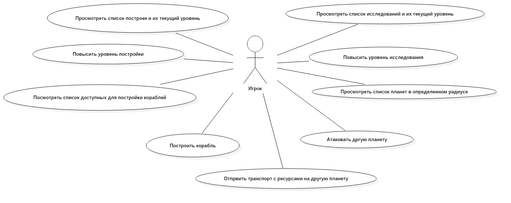

# InSpace
## Описание
Приложение представляет зведный симулятор. Игроку дается во владение 
планета. На планете можно сторить шахты для добычи ресурсов, постройки для производства кораблей и оборонительных 
сооружений. Так же ресурсы можно тратить на развитие технологий. Основная цель развить экономику, построить мощный флот 
и атаковать другие планеты для добычи ресурсов, чтобы занять лидирующую позицую в топе. Топ формируется по количеству очков, 
которое дается за постройки и исследования.

### Игровая модель и механика

#### Планета
Плантеа дается игроку в начале игры. Планета занимает какую либо позицую в системе (от `1` до `10`), что влияет на 
некоторые ее характеристики. По ходу игры игрок может колонизировать планеты.

##### Размер
Планета имеет размер, измериемый в полях пригодных для постройки. Для первой планеты игрока размер устанвливается равным 
`100` полей. Размер колонизируемых плаент составляет от `85` до `115`, он выбирается случайно по законо нормального 
распределения. 

##### Температура
Средняя температура на поверхности планеты зависит от ее позиции в системы (удаленность от звезды) и варьируется от `-30`
до `+30`.

#### Построки
В начале игры уровень каждой постройки равен `0`, для повышения уровня нужны ресурсы и это занимает определнный 
промежуток времени. Количество место занимаемых постройкой на пленте соотвествует ее уровню.

##### Добыча ресурсов 
На планете возможна добычи три типа ресурсов: металлы, кристаллы и дейтерий. Металлы и кристалы используются для 
постройки зданий, дейтрий используется как топливо и все ресурсы необходимы для исследований. Количество добываемых 
ресуросов зависит от размера (количество добываемых ресурсов умножается на `'размер планеты'/200`). Количество 
получаемого дейтерия завсит от средней темепературы на планете.
Существует три типа шахт: по одной для каждого типа ресурсов. Каждая шахта может быть улучшена, это реализуется путем 
повышения уровня. Максимальный уровень шахты не ограничен. Кроме того, для работы шахт необходима электроэнергия которая
добывается с помощью электростаниции, механика улучшения станции и добычи энергии схожа с механикой шахт.

TODO Добавить формулы для расчета ресурсов времени и ресурсов необходимых на постройку, количества добываемых ресурсов и
потреблеия энергии.

##### Производство и исслдования
Существует 3 типа производственных построек: верфь, исследовательская лаборатория и фабрика. Верьф необходима для 
постройки кораблей, лаборатория - для проведения исслдеований, а фабрика - для строительства новых зданий. С повышением
уровня каждой постройки уменьшается время необходимое для сборки короблей, проведения исследований и строительства 
зданий соответсвенно.
#### Исследования
Исследования, аналогично построкам, имеют опредленный уровень и на его повышение необходимы ресурсы и время.

TODO: добавить конкретные исследования
#### Корабли
TODO: добавить характеристики
##### Гражданские

* Малый транспорт

Корабль предназначен для перевозки небольшого количества ресурсов. Практически не обладает вооружением.

* Большой транспорт

Корабль предназначен для перевозки большого количества ресурсов. Практически не обладает вооружением, но неплохо защищен.

* Колонизатор

Необходим для колонизации новых планет.

##### Боевые

* Истрибитель

Быстрый и маневренный корабль, но плохо вооружен и не имеет крепкой брони. Эффективен при перехвате флотов.

* Крейсер

Сбалансированный корабль: имеет достаточно вооружения, но при этом довольно быстрый и маневренный.

* Линкор

Тяжело вооруженный и хорошо бронированный корабль, обладает маленькой скоростью, но очень эффективен в бою.

Мощный
#### Механика боев
TODO описать.
## MVP
Консольное приложение которое позволяет выполнять все базовые действия: смотреть список построек, исследований и их 
уровень, повышать уровень построек и исслдеований, строить корабли, атаковать другие планеты, отправлять транспортный 
флот на другие планеты, колонизировать планеты.
## UML Диаграмы
### Диаграма прцедентов 
